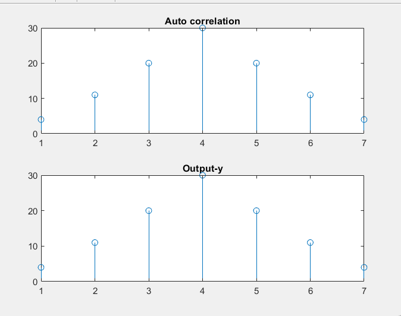
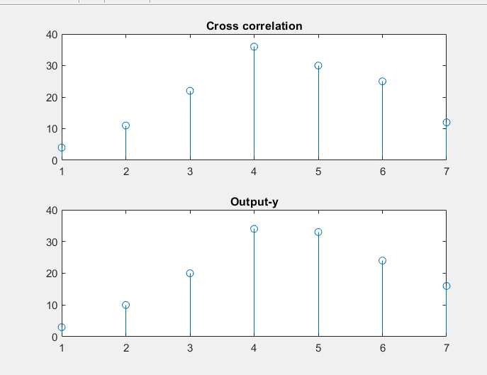

## Experiment No : 03

## Submission Date : May 15, 2023

## Experiment Name : Finding and plotting the Auto Correlation and Cross Correlation of two discrete signals on Matlab.


---

## Theory:

<p style="text-align: justify">
Autocorrelation is a mathematical representation of the degree of similarity between a given time series and a lagged version of itself over successive time intervals. It's conceptually similar to the correlation between two different time series, but autocorrelation uses the same time series twice: once in its original form and once lagged one or more time periods.
</p>
<p style="text-align: justify">
Cross-correlation is a measurement that tracks the movements of two or more sets of time series data relative to one another. It is used to compare multiple time series and objectively determine how well they match up with each other and, in particular, at what point the best match occurs.
Cross-correlation may also reveal any periodicities in the data.

</p>
<br>
<b> Required Software : Matlab</b>
<br>
<b> Required Language : Matlab</b>
<br>

## Code:
<br>
<b> Cross correlation</b>
  <br>
  
```matlab

clc; clear all;
x=input('Enter the input signal'); h=fliplr(x);
z=[];
for i=1:length(x) g=h.*x(i);
z=[z;g];
end
[r c]=size(z);
 k=r+c;
t=2;
y=[];
cd=0;
while(t<=k)
for i=1:r
for j=1:c
if(i+j==t)
cd=cd+z(i,j);
end
end
end t=t+1;
y=[y cd];
 
cd=0;
end
disp(y);
subplot(2,1,1)
stem(xcorr(x));
title('Auto correlation')
subplot(2,1,2);
stem(y);
title('Output-y')

```

## Output:


<br>
**Fig 3.1** : Figure of Auto Correlation 

<br>
<b> Cross correlation</b>
  <br>
  
```matlab
clc;
clear all;
x=input('Enter the first input signal'); x1=input('Enter the second input signal'); h=fliplr(x1);
z=[];
for i=1:length(x) g=h.*x(i);
z=[z;g];
end
[r c]=size(z); k=r+c;
t=2; y=[];
cd=0;
 
while(t<=k) for i=1:r
for j=1:c
if(i+j==t) cd=cd+z(i,j);
end end
end t=t+1; y=[y cd]; cd=0; end disp(y);
subplot(2,1,1) stem(xcorr(x,h)); title('Cross correlation') subplot(2,1,2);
stem(y); title('Output-y')

```

## Output:


<br>
**Fig 3.1** : Figure of Cross correlation
<br>


## Discussion:

<p style="text-align: justify">

The task was about implimenting auto correlation and cross correlation from input signals.And then checking these two by the build in function xcorr(x) and xcorr(x,h) respectively. And both the correlation were implimented by matrix method.
In auto correlation as onle one input could be taken so the second signal was its delayed or reversed version. Then a 2D array matrix was formed by these two discrete signal values.Then the final result was taken out by summing the upper and lower triangular matrix operation.
In cross correlation same process was applied. Just here in this case two discrete signals were taken as input instead of one and then taking the reverse of that.


</p>

## Conclusion:

<p style="text-align: justify">

All the desired outputs were attained from the above programs.

</p>

## References:
[1]	" Auto correlation", investopedia, 2023. [Online]. Available: https://www.investopedia.com/terms/c/crosscorrelation.asp#:~:text=Cross%2Dcorrelation%20is
%20a%20measurement,point%20the%20best%20match%20occurs/ [Accessed:14-May- 2023].

[2]	" Cross correlation", investopedia, 2023. [Online]. Available: https://www.investopedia.com/terms/a/autocorrelation.asp#:~:text=Autocorrelation%20is%20the
%20correlation%20of,movements%20and%20predict%20future%20ones./ [Accessed:14-May- 2023].


