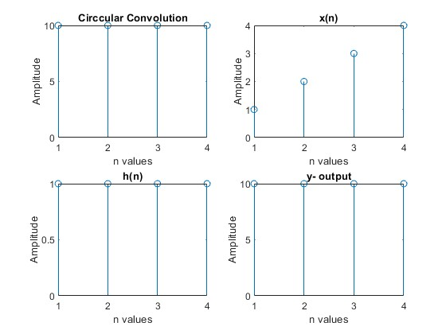
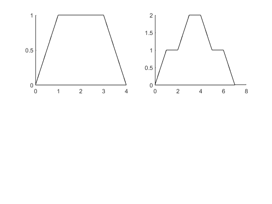

## Experiment No : 02

## Submission Date : May 08, 2023

## Experiment Name :

## Implementation of circular convolution, sum and subtract of two signals and draw two particular figures in MATLAB.

---

## Theory :

<p style="text-align: justify">
Circular convolution is defined for periodic sequences, whereas convolution is defined for aperiodic sequences. The circular convolution of two N-point periodic sequences x(n) and y(n) is the N-point sequence a(m) = x(n)* y(n), defined by

    ```
                               N-1
                a(m)=x(m)*y(m)=∑x(n)− y(m−n),m=0,1,2,…,N−1.
                               n=0

    ```
</p>
<p style="text-align: justify">
The two sequences are first padded with zeros to make them the same length before performing circular convolution in the same manner as linear convolution. However, the result is taken modulo the length of the sequences, which wraps the result around to the beginning of the series, rather than discarding the bits of the result that are attributable to the zero-padding.
</p>

<p style="text-align: justify">
And another task was to plot the summation and subtraction of two discrete signals which were
n1=[0,0,0,2,2,2,1,1,1,0,2];
n2=[2,2,0,1,1,1,0,0,0,0,3];

And last task was to plot two given signals on same figure on Matlab.


## Code :

<b> Finding the circular convolution from a given two discrete signals: </b>
 <br>
 
clc;
clear all;
x=[1,2,3,4];
h=[1,1,1,1];
m=length(x);
m1=length(h);
N=max(m,m1);
z=cconv(x,h,N);
subplot(2,2,1);
stem(z);
xlabel('n values');
ylabel('Amplitude');
title('Circcular Convolution');

subplot(2,2,2);
stem(x);
xlabel('n values');
ylabel('Amplitude');
title(' x(n) ');
subplot(2,2,3);
stem(h);
xlabel('n values');
ylabel('Amplitude');
title(' h(n) ');

X=[x,zeros(1,m)];
H=[h,zeros(1,m1)];
y=zeros(1,N);
for n=1:N
    for m=1:N
        j=mod(n-m,N);
        j=j+1;
            y(n)=y(n)+x(m)*h(j);
        end
   end
subplot(2,2,4);
stem(y);
xlabel('n values');
ylabel('Amplitude');
title(' y- output ');

## Output:



**Fig.** : Convolution of two signals using conv function

<b> For plotting two signals and showing their summation and subtraction: </b> 
<br>

```matlab
close all;
clear all;
n1=[0,0,0,2,2,2,1,1,1,0,2];
n2=[2,2,0,1,1,1,0,0,0,0,3];
subplot(4,2,1);
stem(n1);
title('n1 Signal');
subplot(4,2,2);
stem(n2);
title('n2 Signal');
subplot(4,2,3);
stem(n1+n2);
title('Summation');
subplot(4,2,4);
stem(n1-n2);
title('Subtraction');

```

## Output :


**Fig.:** Convolution of two signals without using conv function

Drawing the figure of given signals using array and plot:

```matlab
clc;
clear all;
h=1;
a=2;
b=4;
A=[0,0];
B=[b,0];
C=[0.5*(b-a)+a h];
D=[0.5*(b-a) h];
coor=[A;B;C;D];
subplot(2,2,1);
patch(coor(:,1),coor(:,2),'w');
e=[0,0];
f=[1,1];
g=[2,1];
h=[3,2];
i=[4,2];
j=[5,1];
k=[6,1];
l=[7,0];
coor1=[e;f;g;h;i;j;k;l];
subplot(2,2,2);
patch(coor1(:,1),coor1(:,2),'w');

```

## Output:



**Fig.:** Convolution of two signals without using conv function

## Discussion :

All the operations performed successfully and was verified with the theory.

