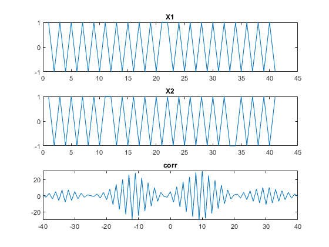

## Experiment No : 04

## Submission Date : May 22, 2023

## Experiment Name : Finding the time delay between two signals from their auto correlation.
---

## Theory:

<p style="text-align: justify">
Time delay analysis finds the delay (also called the “lag”) between two signals, that are shifted in time. It is the most important part of time-difference-of-arrival (TDOA) transmitter localization.For delay analysis, correlation in the time domain is widely used. The correlation function plots the similarity between two signals for all possible lags T.
  
```

                                               N-1
                                       Corr(T)=∑S1(t) * S2(t+T)
                                               t=0
```
  
The peak of the correlation function occurs at the lag with the best similarity between the two signals, i.e. the estimated delay. [2]

```
                                       T_estimated=arg max(Corr(τ))
```
</p>
<br>
   Required Software:<b> Matlab</b>
<br>
Required Language: <b>   Matlab </b>
<br>
<br>


## Code:

```matlab
clc;
clear all;
t=-20:1:20;
x1=square(3*t);
x2=square(3*(t+10));
[corr,t]=xcorr(x1,x2)
subplot(3,1,1)
plot(x1);
title('X1')
subplot(3,1,2)
plot(x2);
title('X2')
subplot(3,1,3)
plot(t,corr)
title('corr')
mag=max(corr(:))
delay=find(corr(:)==mag);
if delay>40
    delay=delay1-41;
end
if delay1<40
    delay=40-delay1;
end

delay


```

## Output:



```

Here
 Maximum magnitude = 31
 delay = 10


```

## Discussion:

<p style="text-align: justify">

Here the main task was to find the time delay betwwen two signals from their autocorrelation. And the index on the time axis represents the delay on which the amplitude of the correlation is maximum needed to show on the output side. So there was a problem in finding the exact time on which the amplitude was maximum because the time scaling of the two signals and their corresponding correlation was not compatible with each other. That’s why a scaler value was added to the found time delay from the plot and then the exact time delay which was taken between two of those signals were found.
</p>

## Conclusion:

<p style="text-align: justify">

All the desired outputs were attained from the above programs.

</p>

## References:

"[1]" Correlation for Time Delay Analysis", panoradioSDR, 2023. [Online]. Available: https://panoradio-sdr.de/correlation-for-time-delay-analysis/ [Accessed:18-May- 2023].

